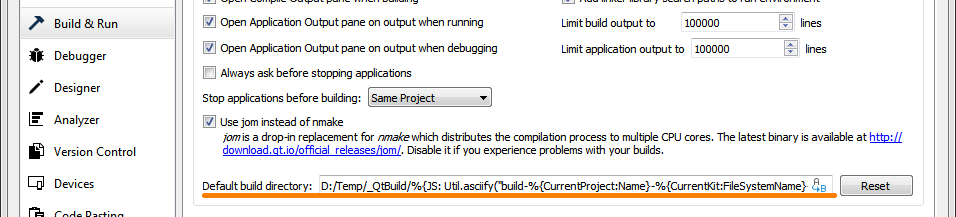

# Desktop program written by Qt

Here are the desktop programs that written by Qt.


## Linux (Ubuntu 20.4)

- Qt 5.15 (Community version)


At build directory, run the ```gen_AppImage.sh``` script to generate the App Image.


## Windows

- Qt 5.11.3 (Community version)
- Qt Installer Framework 3.0
- ImageMagick 7.0.8

**Example for the QT Creator default build directory:**

```
D:/Temp/_QtBuild/%{JS: Util.asciify("build-%{CurrentProject:Name}-%{CurrentKit:FileSystemName}-%{CurrentBuild:Name}")}
```


